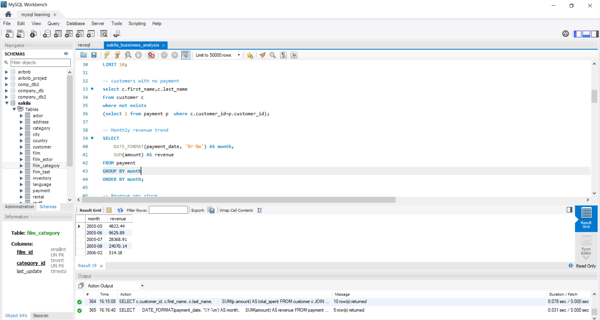

# 🎬 Movie Rental Business Analysis (SQL Project)

## 📌 Overview
This project analyzes a movie rental business using the Sakila database. The goal is to extract actionable insights related to customer behavior, revenue generation, and film performance using SQL.

## 🛠 Tools & Technologies
- SQL (MySQL)
- Sakila Database

## 📊 Business Problems Solved

### 🔹 Customer Analysis
- Identified top customers based on total spending
- Segmented customers into High, Medium, and Low value groups using CASE statements

### 🔹 Revenue Analysis
- Calculated total revenue generated by the business
- Analyzed monthly revenue trends

### 🔹 Film Performance Analysis
- Identified most and least rented films
- Extracted Top 3 films in each category using window functions (RANK)

### 🔹 Category Insights
- Determined most popular film categories
- Analyzed rental distribution across categories

## 🔥 Key Insights
- Top customers contribute a significant portion of total revenue
- Certain film categories consistently perform better in rentals
- A small number of films drive majority of rental activity
- Customer segmentation helps identify high-value users

## 📸 Sample Outputs

### Top Customers by Spending

### Revenue Analysis

## 📁 Project Structure
