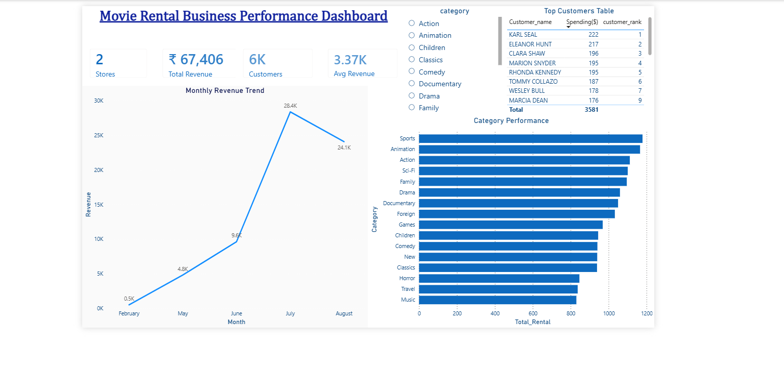

# 🎬 Movie Rental Business Analysis (SQL + Power BI Project)

## 📌 Overview

This project analyzes a movie rental business using the Sakila database. The objective is to extract meaningful insights related to customer behavior, revenue trends, and film performance, and present them through an interactive dashboard.

---

## 🛠 Tools & Technologies

* SQL (MySQL)
* Power BI
* Sakila Database

---

## 📊 Business Problems Solved

### 🔹 Customer Analysis

* Identified top customers based on total spending
* Segmented customers into High, Medium, and Low categories
* Detected customers with no transactions

---

### 🔹 Revenue Analysis

* Calculated total revenue generated
* Analyzed monthly revenue trends
* Compared revenue across stores

---

### 🔹 Film Performance

* Identified most and least rented films
* Found Top 3 films in each category using window functions

---

### 🔹 Category Insights

* Analyzed most popular film categories
* Studied rental distribution across categories

---

## 📈 Power BI Dashboard

An interactive dashboard was built to visualize key business insights:

* KPI cards (Total Revenue, Customers, Stores)
* Monthly Revenue Trend (Line Chart)
* Category Performance (Bar Chart)
* Top Customers Table with Ranking
* Category-based filtering using slicer

### 📸 Dashboard Preview

---

## 📸 Sample SQL Outputs

### Monthly Revenue Trend

---

## 📁 Pr

